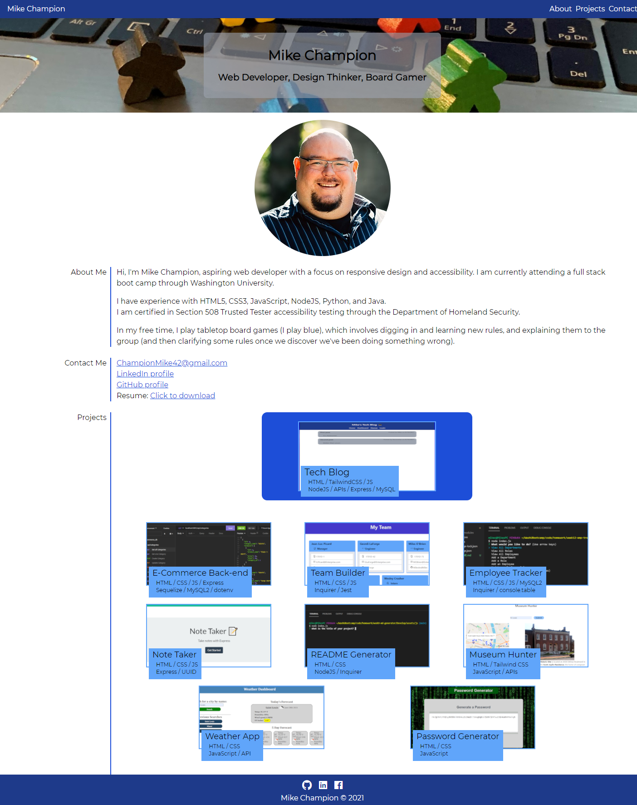

# WashU Bootcamp Homework, Week sixteen

## Table of Contents

I. [Description](#description)  
II. [Project screenshot](#screenshot)  
III. [Link to deployed page](#live-page)  
IV. [Contact information](#contact)

## <a id="description">I. Description</a>

Week sixteen homework.  
Updating my previously created portfolio page with homework and projects completed since the last update in week eight.
Updating pinned repositories and deployed page on Github.

## <a id="screenshot">II. Screenshot</a>

## <a id="live-page">III. Link to deployed page</a>

Portfolio
https://mikechampion.github.io/portfolio/

## <a id="contact">IV. Contact</a>

Linkedin profile
https://www.linkedin.com/in/MikeChampion42

Github profile
https://github.com/MikeChampion

PDF resume
https://mikechampion.github.io/portfolio/assets/pdf/Michael_Champion_Resume_0621.pdf
